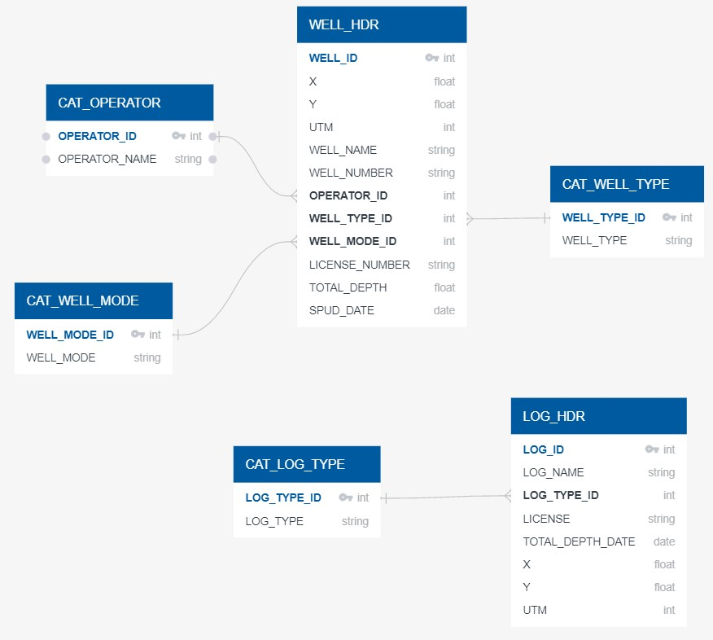

# ETL_Project
Leonides Guerra, Tania Rosas, Ignacio Morales,  David Zubieta

# Technical Report

The two data sources used in this project came from the following websites:
-https://www.kaggle.com/vaishnavivenkatesan/ontario-petroleum-wells
-http://www.ogsrlibrary.com/data_free_petroleum_ontario

*The two original sources were in CVS an excel format

After analyzing the two data and coming up with what outcome was wanted out of them, this diagram was formed:
  

Then, we developed an ETL structure of how we were going to develop our project and its outcome.

After running the code (seen in Jupyter Notebook files), this is the result obtained from loading the information into PgAdmin

